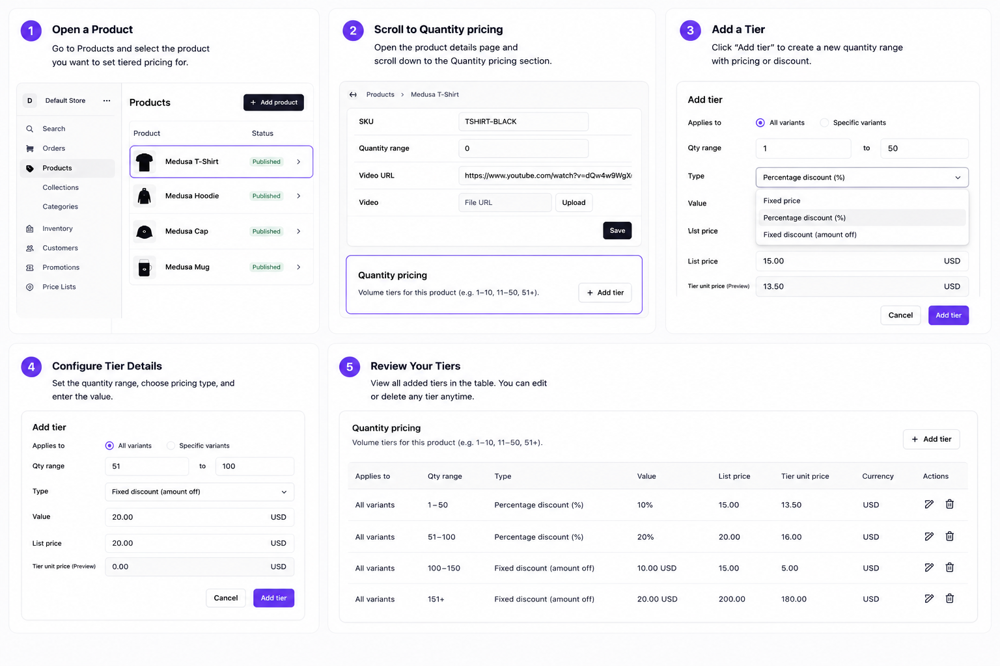

# @webbycrown/medusa-quantity-pricing

[](https://www.npmjs.com/package/@webbycrown/medusa-quantity-pricing)

A **Medusa v2 plugin** for **quantity range pricing** (volume / tiered / wholesale pricing). Set different unit prices based on how many items a customer buys — with fixed prices, percentage discounts, or fixed amount-off tiers.




## Features

- **PostgreSQL-backed** `quantity_prices` table (Medusa module + migrations)
- **Three pricing types** — `fixed`, `percentage`, `fixed_discount`
- **Admin API** — full CRUD with Zod validation
- **Store API** — list tiers and calculate price for a quantity
- **Catalog price helper** — `GET /admin/quantity-pricing/catalog-prices`
- **Medusa Admin UI**
  - **Settings → Extensions → Quantity Pricing** — manage all rules (create, edit, delete)
  - **Each product page** — tiers for that product with variant selector
  - **Settings → Store** — summary widget with link to settings
- **Workflows** with compensation steps (create / update / delete)
- **Auto cleanup** when a product is deleted (`product.deleted` subscriber)
- **B2B-ready** — optional variant, region, and customer-group scoping
- **Exported helpers** — `resolveQuantityUnitPrice`, catalog utilities, workflows

---

## Requirements

| Requirement | Version |
|-------------|---------|
| Node.js | 20+ |
| Medusa | v2.13+ (`@medusajs/framework` ^2.13) |

---

## Installation

### 1. Install the package

```bash
npm install @webbycrown/medusa-quantity-pricing
```

**Monorepo / local path:**

```json
{
  "dependencies": {
    "@webbycrown/medusa-quantity-pricing": "file:../../packages/medusa-quantity-pricing"
  }
}
```

Build the plugin:

```bash
cd packages/medusa-quantity-pricing
npm run build
```

### 2. Register the plugin

In `medusa-config.ts`:

```ts
import { defineConfig } from "@medusajs/framework/utils"

export default defineConfig({
  // ...
  plugins: [
    {
      resolve: "@webbycrown/medusa-quantity-pricing",
      options: {},
    },
  ],
})
```

> The plugin registers the `pricingEngine` module automatically. Do **not** add a duplicate entry under `modules`.

### 3. Run migrations

```bash
npx medusa db:migrate
```

### 4. Start Medusa

```bash
npm run dev
```

Open Admin → **Settings → Extensions → Quantity Pricing** to create your first tiers.

---

## Admin UI

| Location | What you can do |
|----------|-----------------|
| **Settings → Extensions → Quantity Pricing** | List, create, edit, and delete rules for any product |
| **Products → [product]** | Manage tiers for that product (product ID pre-filled) |
| **Settings → Store** | Rule count + link to settings |


### Tier fields

| Field | Description |
|-------|-------------|
| **Product ID** | Required (auto-filled on the product page) |
| **Variant** | Optional — empty = all variants |
| **Min qty** | Minimum quantity for this tier (e.g. `1`) |
| **Max qty** | Upper bound (e.g. `50`). Leave **empty** for open-ended tiers (e.g. `51+`) |
| **Pricing type** | `Fixed price`, `Percentage discount`, or `Fixed discount` |
| **Discount / unit price** | See [Pricing types](#pricing-types) |
| **Currency** | ISO 4217 code, e.g. `inr`, `usd`, `eur` |
| **List price (reference)** | For discount tiers when catalog price is unavailable |

The form shows **List price** (from Medusa variant pricing) and **Tier unit price** (what the customer pays). For discount tiers, set variant prices under **Products → [product] → variant → Prices**, or enter **List price (reference)** when there are no variants.

### Tips

- Use non-overlapping ranges per product + currency when possible (e.g. 1–10, 11–50, 51+).
- When ranges overlap, the tier with the **highest `min_qty`** that still fits the quantity wins.
- Match **currency_code** to your store region so storefront and cart logic resolve correctly.

---

## Pricing types

Each rule has a `pricing_type`. The `price` field meaning depends on the type.

| Type | `price` means | Resolved unit price |
|------|----------------|---------------------|
| `fixed` | Tier unit price | `price` |
| `percentage` | Percent off catalog (e.g. `10` = 10% off) | `base × (1 − price/100)` |
| `fixed_discount` | Amount off per unit | `max(base − price, 0)` |

`base` is resolved in this order:

1. `base_unit_price` passed to the Store API or `resolveQuantityUnitPrice`
2. Medusa variant catalog price for the same `currency_code`
3. `reference_unit_price` stored on the rule

**Example — percentage tier (10% off, list ₹120):**

```json
{
  "pricing_type": "percentage",
  "price": 10,
  "currency_code": "inr",
  "reference_unit_price": 120
}
```

Resolved unit price: **₹108**.

---

## Store API

**`GET /store/quantity-pricing`**

Requires a valid **publishable API key** (same as other store routes).

### Query parameters

| Param | Required | Description |
|-------|----------|-------------|
| `product_id` | Yes | Product to load tiers for |
| `variant_id` | No | Prefer variant-specific rules; includes product-level fallback |
| `currency_code` | No | Filter tiers by currency; used for calculation |
| `customer_group_id` | No | B2B / wholesale segment |
| `region_id` | No | Regional override |
| `quantity` | No | When set, response includes `calculated_price` |
| `base_unit_price` | No | Catalog unit price for discount tiers; auto-loaded from variants when omitted |

### List tiers

```http
GET /store/quantity-pricing?product_id=prod_01XXXX&currency_code=inr
```

```json
{
  "quantity_prices": [
    {
      "id": "qprice_01...",
      "product_id": "prod_01...",
      "variant_id": null,
      "min_qty": 1,
      "max_qty": 10,
      "pricing_type": "fixed",
      "price": 100,
      "currency_code": "inr",
      "reference_unit_price": null
    }
  ],
  "calculated_price": null
}
```

> Without `variant_id`, only **product-level** tiers (`variant_id = null`) are returned. With `variant_id`, variant-specific tiers are returned with product-level fallback.

### Calculate price for a quantity

```http
GET /store/quantity-pricing?product_id=prod_01XXXX&currency_code=inr&quantity=25&variant_id=variant_01...
```

```json
{
  "quantity_prices": [ "..." ],
  "calculated_price": {
    "unit_price": 90,
    "quantity": 25,
    "currency_code": "inr",
    "rule_id": "qprice_02...",
    "pricing_type": "fixed",
    "rule_value": 90,
    "base_unit_price": null,
    "min_qty": 11,
    "max_qty": 50,
    "line_total": 2250
  }
}
```

---

## Admin API

All routes require an authenticated admin session or admin API token.

| Method | Path | Description |
|--------|------|-------------|
| `GET` | `/admin/quantity-pricing` | List rules (`product_id`, `variant_id`, `currency_code`, `limit`, `offset`, …) |
| `POST` | `/admin/quantity-pricing` | Create rule |
| `GET` | `/admin/quantity-pricing/:id` | Get one rule |
| `PUT` | `/admin/quantity-pricing/:id` | Update rule |
| `DELETE` | `/admin/quantity-pricing/:id` | Delete rule |
| `GET` | `/admin/quantity-pricing/catalog-prices` | Variant catalog unit prices (`product_id`, `currency_code`) |

### Create rule (`POST`)

**Fixed price tier:**

```json
{
  "product_id": "prod_01XXXXXXXX",
  "variant_id": null,
  "min_qty": 1,
  "max_qty": 10,
  "pricing_type": "fixed",
  "price": 100,
  "currency_code": "inr"
}
```

**Open-ended tier (51+):**

```json
{
  "product_id": "prod_01XXXXXXXX",
  "min_qty": 51,
  "max_qty": null,
  "pricing_type": "fixed",
  "price": 80,
  "currency_code": "inr"
}
```

**Percentage discount (10% off catalog):**

```json
{
  "product_id": "prod_01XXXXXXXX",
  "variant_id": "variant_01XXXXXXXX",
  "min_qty": 11,
  "max_qty": 50,
  "pricing_type": "percentage",
  "price": 10,
  "currency_code": "inr",
  "reference_unit_price": 120
}
```

### List response

```json
{
  "quantity_prices": [ "..." ],
  "count": 3,
  "offset": 0,
  "limit": 50
}
```

---

## Cart integration

The plugin does **not** ship cart routes. It exports `resolveQuantityUnitPrice` so your Medusa app can apply tier prices when adding or updating line items.

```ts
import { resolveQuantityUnitPrice } from "@webbycrown/medusa-quantity-pricing"

const unit_price = await resolveQuantityUnitPrice(container, {
  product_id: "prod_01...",
  variant_id: "variant_01...",
  quantity: 25,
  currency_code: "inr",
  // Optional: pin the tier the customer selected on the product page
  rule_id: "qprice_02...",
})
```

Pass `unit_price` into `addToCartWorkflow` (or your custom workflow) when the value is non-null. Match cart **currency** to the tier `currency_code`.

**Recommended line-item metadata** (for reconciliation and updates):

- `quantity_rule_id` — selected tier id
- `tier_currency_code` — currency used when the tier was chosen

See your host app’s tiered cart routes (e.g. `POST /store/carts/:id/line-items-tiered`) for a full example.

---

## Storefront integration

Use the Store API on product pages to show a quantity pricing table and resolve the unit price for the selected quantity.

### 1. Fetch tiers

```ts
const params = new URLSearchParams({
  product_id: productId,
  currency_code: currencyCode.toLowerCase(),
})
if (variantId) params.set("variant_id", variantId)

const { quantity_prices } = await sdk.client.fetch<{
  quantity_prices: Array<{
    id: string
    min_qty: number
    max_qty: number | null
    pricing_type: string
    price: number
    currency_code: string
  }>
}>(`/store/quantity-pricing?${params}`, { method: "GET" })
```

### 2. Calculate price server-side

```http
GET /store/quantity-pricing?product_id=...&currency_code=inr&quantity=25&variant_id=...
```

Use `calculated_price.unit_price` from the response.

### 3. Add to cart

Send the selected tier’s `id` as `quantity_rule_id` (or pass the resolved `unit_price`) to your tiered cart endpoint so the backend recalculates with the same rule.

---

## Use in backend / custom code

```ts
import {
  PRICING_ENGINE_MODULE,
  resolveQuantityUnitPrice,
  fetchCatalogPricesForProducts,
} from "@webbycrown/medusa-quantity-pricing"

// Helper — returns unit price or null
const unitPrice = await resolveQuantityUnitPrice(container, {
  product_id: "prod_01...",
  quantity: 25,
  currency_code: "inr",
  variant_id: "variant_01...",
  rule_id: "qprice_02...", // optional
})

// Service API
const pricingEngine = container.resolve(PRICING_ENGINE_MODULE)
const rules = await pricingEngine.getRules({
  product_id: "prod_01...",
  currency_code: "inr",
})
const result = await pricingEngine.calculatePrice({
  product_id: "prod_01...",
  quantity: 25,
  currency_code: "inr",
  variant_id: "variant_01...",
})
```

### Workflows

```ts
import {
  createQuantityPricingRuleWorkflow,
  updateQuantityPricingRuleWorkflow,
  deleteQuantityPricingRuleWorkflow,
} from "@webbycrown/medusa-quantity-pricing/workflows"
```

### Exported symbols

| Export | Purpose |
|--------|---------|
| `PRICING_ENGINE_MODULE` | Container key (`"pricingEngine"`) |
| `pricingEngineModule` | Module definition |
| `PricingEngineService` | Service class |
| `resolveQuantityUnitPrice` | Cart / checkout helper |
| `fetchCatalogPricesForProducts` | Batch catalog prices |
| `getBaseUnitPriceForRule` | Resolve base price for a rule |
| Types | `QuantityPriceRuleDTO`, `CalculatePriceInput`, `PricingType`, … |
| `./workflows` | Create / update / delete workflows |

---

## How tier matching works

1. Load rules for `product_id` (+ optional `currency_code`, `variant_id`, `region_id`, `customer_group_id`).
2. If `variant_id` is provided, **variant-specific** rules are preferred over product-wide rules (`variant_id = null`).
3. Keep rules where `min_qty ≤ quantity` and (`max_qty` is `null` or `quantity ≤ max_qty`).
4. If several match, the rule with the **highest `min_qty`** wins.
5. Resolve `unit_price` from `pricing_type` and catalog / `reference_unit_price`.

---

## Database

Table: **`quantity_prices`**

| Column | Type | Notes |
|--------|------|--------|
| `product_id` | text | Required |
| `variant_id` | text, nullable | `null` = all variants |
| `min_qty` | int | Required, ≥ 1 |
| `max_qty` | int, nullable | `null` = no upper limit |
| `pricing_type` | text | `fixed` \| `percentage` \| `fixed_discount` |
| `price` | numeric | Meaning depends on `pricing_type` |
| `currency_code` | text | e.g. `inr` |
| `reference_unit_price` | numeric, nullable | List price for discount tiers |
| `customer_group_id` | text, nullable | B2B segment |
| `region_id` | text, nullable | Regional rule |

After model changes:

```bash
npx medusa db:generate pricingEngine
npx medusa db:migrate
```

---

## Publishing to npm

| Path | Git | npm |
|------|-----|-----|
| `src/` | **Not committed** (local dev only) | **Not published** |
| `dist/` | **Not committed** (build output) | **Published** (compiled plugin) |
| `.medusa/server/` | **Not committed** | Not published; created on `postinstall` from `dist/` for Medusa runtime |

```bash
cd packages/medusa-quantity-pricing
npm run build          # builds .medusa/server, copies to dist/
npm run pack:check     # dry-run: should list dist/ only (no src/)
npm publish --access public
```

On `npm install`, `postinstall` copies `dist/` → `.medusa/server/` so Medusa can load the plugin. Consumers never receive TypeScript source.

---

## Development

```bash
cd packages/medusa-quantity-pricing
npm run dev    # watch mode
npm run build  # production build → .medusa/server and dist/
```

After plugin changes, rebuild and restart your Medusa app:

```bash
cd packages/medusa-quantity-pricing && npm run build
cd apps/backend && npm run dev
```

---

## Troubleshooting

| Issue | What to check |
|-------|----------------|
| Admin page **Not Found** | Run `npm run build` in the plugin folder and restart Medusa |
| Store API returns empty `quantity_prices` | Rules exist for that `product_id` and `currency_code`; pass `variant_id` if rules are variant-specific |
| Discount tier shows wrong price | Set variant catalog price or `reference_unit_price`; pass `base_unit_price` on Store API |
| Wrong tier applied | Overlapping ranges — highest `min_qty` wins; verify `min_qty` / `max_qty` |
| Migration errors (`raw_price`) | Run `npx medusa db:migrate` (includes `Migration20260526140000`) |
| Module not found | Plugin listed under `plugins` in `medusa-config.ts`, not duplicated under `modules` |
| Cart price differs from product page | Use `rule_id` / `quantity_rule_id` so the same tier is applied at checkout |

---

## Changelog

See [CHANGELOG.md](./CHANGELOG.md) for release history.

---

## Author

**WebbyCrown**

- Email: info@webbycrown.com
- Website: https://webbycrown.com
